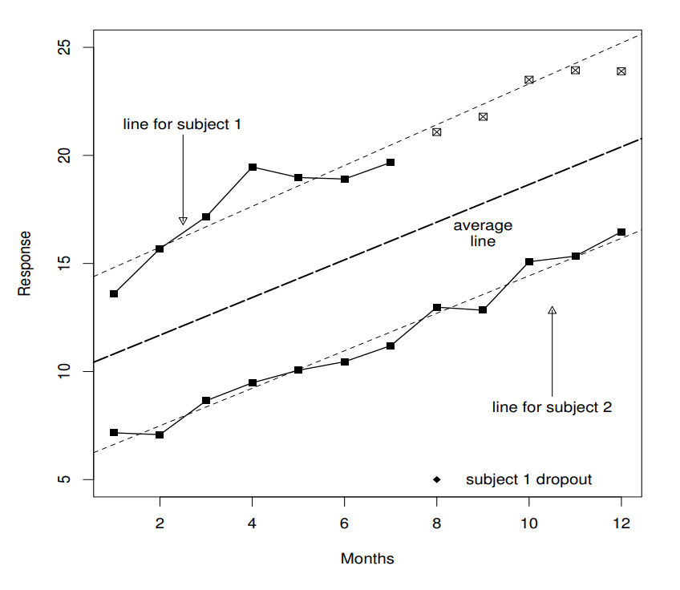

## Alzheimer's Disease Definition

REPHRASE SECTIONS FROM NIA

<Alzheimer's Disease (AD) is an irreversible, progressive brain disorder that affects people’s memory, cognitive thinking, and ability to carry out simple tasks.> In severe cases, people with AD have problems recognizing family and friends, learning new things, and carrying out multi-step tasks such as getting dressed. The US Department of Health and Human Services estimates that there may be more than 5.5 million people in the US with AD, ranked as the sixth leading cause of death in the US, and is the third leading cause of death for older people. The estimated national cost of patient care for AD and other types of dementia was $236 billion in 2016 [1].

Despite the large population affected by AD, currently, there is no drug or any other intervention that can successfully treat it. Current approaches focus on helping people maintain mental function, manage behavioral symptoms, and slow down certain problems, such as memory loss [1].

As a result, early diagnosis is crucial in dealing with AD. However, early AD diagnosis is non-trivial. <Memory problems are typically one of the first signs of cognitive impairment related to AD. Some people with memory problems have a condition called mild cognitive impairment (MCI). People with MCI have more memory problems than normal for their age, but their symptoms do not interfere with their everyday lives. Older people with MCI are at greater risk of developing AD, but not all of them do. Some may even go back to cognitive normal (CN)>. In addition, the ability to detect AD prior to significant memory problems can also be greatly helpful [1].

To diagnose AD, doctors typically carry out some or all of the following procedures (duplicated from [1]):
* Ask the person and a family member or friend questions about overall health, past medical problems, ability to carry out daily activities, and changes in behavior and personality
* Conduct tests of memory, problem-solving, attention, counting, and language.
Carry out standard medical tests, such as blood and urine tests, to identify other possible causes of the problem
* Perform brain scans, such as computed tomography (CT), magnetic resonance imaging (MRI), or positron emission tomography (PET), to rule out other possible causes for symptoms.

The NIA report continues to say: "These tests may be repeated to give doctors information about how a person’s memory and other cognitive functions are changing over time. However, AD can be definitely diagnosed only after death, by linking clinical measures with an examination of brain tissue in an autopsy" [1].

<The causes of AD has not been fully discovered but are likely to be a combination of genetic, environmental, and lifestyle factors. While scientists are still uncertain about the precise cause of AD, research has identified strong indicators for the disease.> <These indicators are typically biomarkers, which are measurements of what is happening inside the living body, shown by the results of laboratory and imaging tests>. Biomarkers that are strong indication of AD include but are not limited to: proteins such as Amyloid-Beta protein (also referred to as Aβ protein or amyloid plaque), and tau protein [3]; functional area (such as hippocampus) or protein concentration (such as Aβ) shown in CT, MRI, and PET (and other special types of such) scans; other results from fluid tests, blood tests.

In answering the question of if a patient will have AD, in this project, we hope to adopt a data-driven method to make such prediction based on biomarkers as well as the results from typical diagnosis procedure results.

## How to Model Longitudinal Data in Medical Studies

### Challenges of Longitudinal Data

Many medical studies are structured around the collection of longitudinal data, in which observations are made repeatedly from the same set of patients over the course of a series of study visits, often spanning months or years. This type of experimental design allows researchers to observe the progression of a disease in a patient, affording them a much more holistic understanding of the phenomena underlying the condition. Additionally, having multiple repeated measurements from the same patients allow for a better understanding of intersubject variability, fascilitating a more robust distinction between random measurement noise and true differences between patients.

While longitudinal studies provide many key advantages over other experimental designs, they also a yield number of statistical complications that must be addressed. One of the foremost challenges is how to actually structure the longitudinal data in an appropriate way before beginning any form of analysis. All of the visits from a particular patient cannot be treated as independent of each other, since they originated from the same source, and thus, all the records from a single source must be combined [4]. A simple approach would be to treat each observation of a certain quantity (e.g. choleserol levels) as separate predictors, so a patient would have a value for their cholesteral at the first visit, one at their second visit, etc. The issue here, however, is that these predictors will be highly correlated with each other, presenting numerical difficulties for most standard statistical techniques [5]. Thus, efforts must be taken to account for this complication.

Another issue that arrises with longitudinal study is missing data. Often, patients will drop out of a study mid-way through. For example, if a terminal disease is being studied, some patients may die during the course of the study, or may become too severely incapacitated to continue attending study visits [5]. The data from these patients should not simply be discarded, since they likely represent the most high-risk population that could benefit the most from the study's results. Additionally, sometimes the experimental design for a study may be altered mid-way through (such as adding a new test metric that was not recorded for the first participants) [4]. This results in all the early participants having missing data, since they do not have the new metric.

One final complication of longitudinal studies is the existance of feedback processes in which the observations made during a patient's visits may influence the types of interventions they receive from their caregivers. This drastically alters many of the standard independence assumptions made in traditional analyses [4]. This type of complicating factor is somewhat beyond the scope of this project. That said, a the ADNI dataset being used does present many of the other standard challenges of longitudinal data—including correlated predictor values and missing data—so techniques were explored to handle both of these issues.

### Correlation of measurements

_Derived Variable Analysis:_

One common approach used to avoid the issue of correlated measurements across patient visits is to generate new features that collapse the longitudinal aspect of the data into a single metric. There are a number of common choices for this mapping, such as taking the mean of the measurements or using the average rate of change [4]. In essense, this very common technique is a form of feature engineering, in which one seeks to capture much of the longitudinal information from the original measurements without introducing predictor colinearity. Depending on the mapping that is used to generate the derived variable, missing data can sometimes prove to be a problem, since some mappings may only function properly when all data is present [4]. Thus, the types of missingness in a dataset must be examined before choosing a set of derived variables.

_Regression Methods:_

As subset of derived variable analsysis, regression methods seek to fit a regression to the longitudinal response of each individual patient (see figure below as an example) and then use the parameters of these regressions as predictors/responses in the overall analysis [6]. This technique allows for highly interpretable derived variables that can be directly related to the longitudinal response of a particular patient. One variant of a regression method was applied to the ADNI dataset as part of our analysis.

	

 Example of a regression method, in which linear models are fit to each individual patient's longitudinal response. Figure duplicated from [4].

### Missing Data

Before attempting to deal with missing data, it is important to understand whether observations are Missing Completely at Random (MCAR), Missing at Random (MAR), or Missing not at Random (MNAR) [5]. If the missingness is completely randomly distributed, then there would be no way _a priori_ to predict which data would be missing. In this case, most statistical estimates would be unbiased. That said, if data were missing due to some underlying phenomena (that is either captured in the data or not), this interaction could skew statistical results. For example, sometimes patients may choose to not return for all the visits of a study if their condition is not severe, and they therefore do not feel they need additional care. This would bias results, since only the more severe patients would be represented in the later subject visits. 

While it is not possible to determine whether there may be external factors contributing to the missingness that were not recorded as part of the study (i.e. MNAR), one must at least check that there are not trends within the dataset that can serve to predict the missingness trends for a particular patient. In subsequent sections, we will examine the types of missingness present in the ADNI dataset.

Assuming that the missingness is relatively random among the patients, there are a number of different techniques for handling the missing values. As discussed in lecture, there are many different imputation schemes that attempt to fill in the missing values based on general statistics of the population (such as mean-imputation and median-imputation). These methods often do not bias overall predictions of a model, though they do skew the distribution and statistics for the resulting model parameters obtained from fitting. 

Another technique—which is utilized in our subsequent analysis—is to use derived variable analysis approaches to "flatten" the longitudinal aspect of the data and then weight the importance of participants based on the number of study visits they completed so as to create an unbiased model [4]. If a given patient is missing a substantial number of study visits, their information will be weighted less in the overall model training. This allows researchers to still use the patient's data without biasing their overall results. 

### References

[1] NIA, Alzheimer's Disease Fact Sheet (2017). https://www.nia.nih.gov/health/alzheimers-disease-fact-sheet

[2] NIA, Biomarkers (2018). https://www.nia.nih.gov/health/biomarkers-dementia-detection-and-research#types

[3] R. H. Swerdlow, "Pathogenesis of Alzheimer's disease," Clinical Interventions in Aging, vol. 2, no. 3, Sep. 2007.

[4] P. Diggle, P. Heagerty, K.-Y. Liang, and S. L. Zeger, Analysis of Longitudinal Data, Oxford University Press, 2013.

[5] T. P. Garcia and K. Marder, “Statistical Approaches to Longitudinal Data Analysis in Neurodegenerative Diseases: Huntington’s Disease as a Model,” Curr. Neurol. Neurosci. Rep., vol. 17, no. 2, 2017.

[6] G. M. Fitzmaurice and C. Ravichandran, “A Primer in Longitudinal Data Analysis,” Circulation, vol. 118, no. 19, Nov. 2008.
